# Citibike New York Sales Analysis

---

## Introduction

This is an Excel project of Citibike New York sales analysis. 
This project is to analyze and derive insights to answer crucial questions and help the store make data-driven decisions.

**_Disclaimer_**: _All datasets and reports do not represent any company, institution, or country, but just a dummy dataset to demonstrate the capabilities of Microsoft Excel._

---

## Table of Content
  - [Problem Statement](#problem-statement)
  - [Data Sourcing](#data-sourcing)
  - [Skills/Concepts Demonstrated](#skills-demonstrated)
  - [Modeling](#modeling)
  - [Data Cleaning and Transformation](#data-cleaning-and-transformation)
  - [Analysis & Visualization](#analysis-and-visualization)
  - [Conclusion and Recommendation](#conclusion-and-recommendation)
  

## Problem Statement

An international company in New York City wishes to know how far they have gone in 2017 between January and March. The stakeholders hereby entrusted me with carrying out a quick analysis and dashboard to enable them make a decision to improve sales. After understanding the business problem, the questions below need answers which covers various aspects of the dataset, including station usage, trip duration, user demographics, time-based trends, and environmental factors. The questions are as follows:

1. Which station has the highest number of trips originating from it?
2. Which month had the highest number of bike trips?
3. How many trips were taken by each user type?
4. Which age group has the highest number of bike riders?
5. Which bike was used for the longest trip?
6. What is the distribution of trip durations among different seasons?
7. What is the average trip duration for each day of the week?
8. Which station has the highest number of trips ending at it?

## Data Sourcing

The dataset was downloaded from the official website of [CitiBike](https://citibikenyc.com/homepage),
It contains 1 table with 17 Columns and 20401 Rows.

---

## Skills Demonstrated

The following Excel features were incorporated:
- Filtering
- Duplicate
- Text to Column
- Calculated Column
- Aggregate Function
- Exploratory Data Analysis

## Modeling

There was no modeling because the dataset contain one table.

---

## Data Cleaning and Transformation

Inspection and cleaning of the dataset was carried out, a view of the raw dataset is shown below:

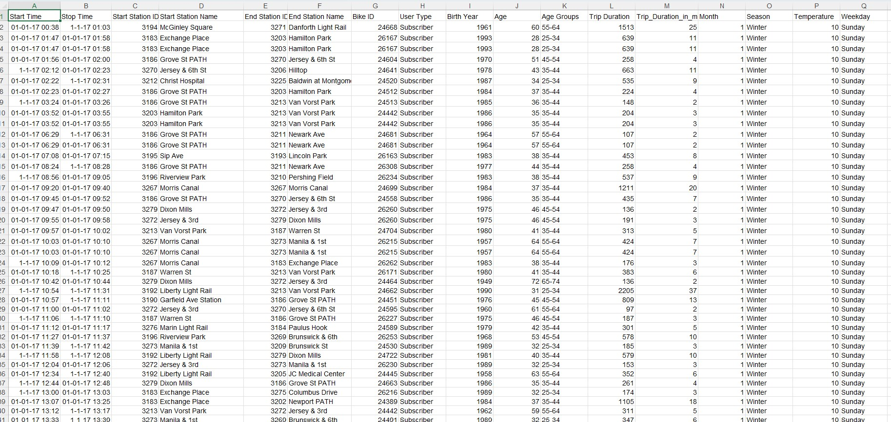

The first step was to Filter the data, remove the blank rows and duplicates. 
Total of 1950 duplicate was discovered and removed after proper consultations with the appropiate stakeholders:

Filtering                               | Removing duplicate
:--------------------------------------:|:----------------------------------:
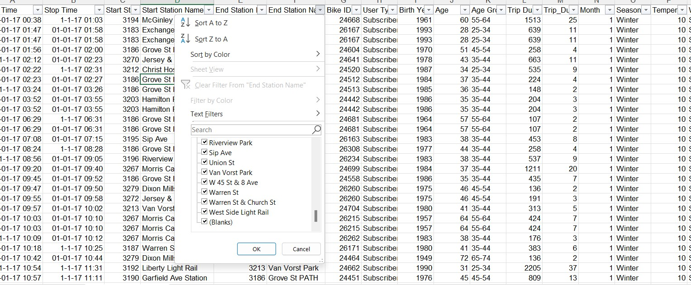                         |   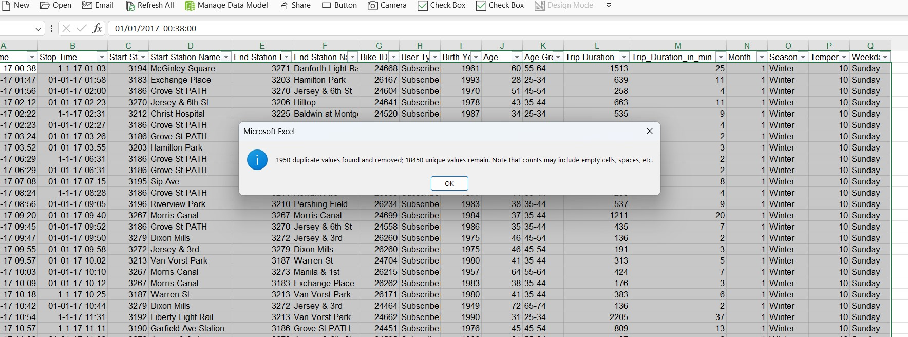

Then, the Start and Stop Time were separated into Start Date, Start Time, Stop Date, and Stop Time columns using the Text to Column Wizard:

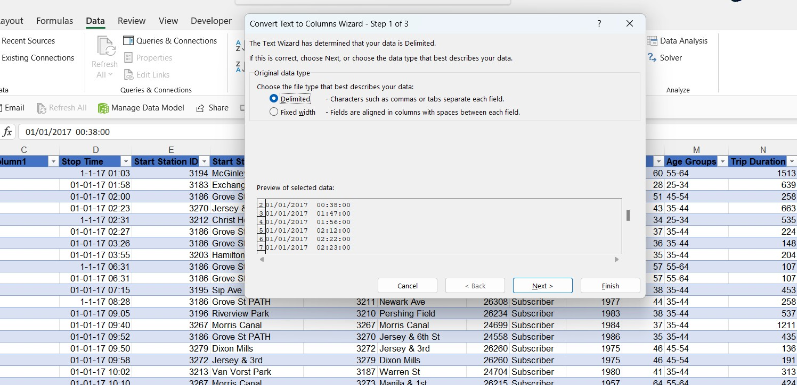

A column was added to the dataset to enable us to calculate the Average Trip Duration:

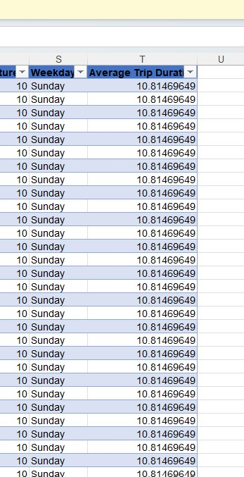

Finally, we have a cleaned dataset aligned to our business question that will enable us to derive insight and profer solutions:

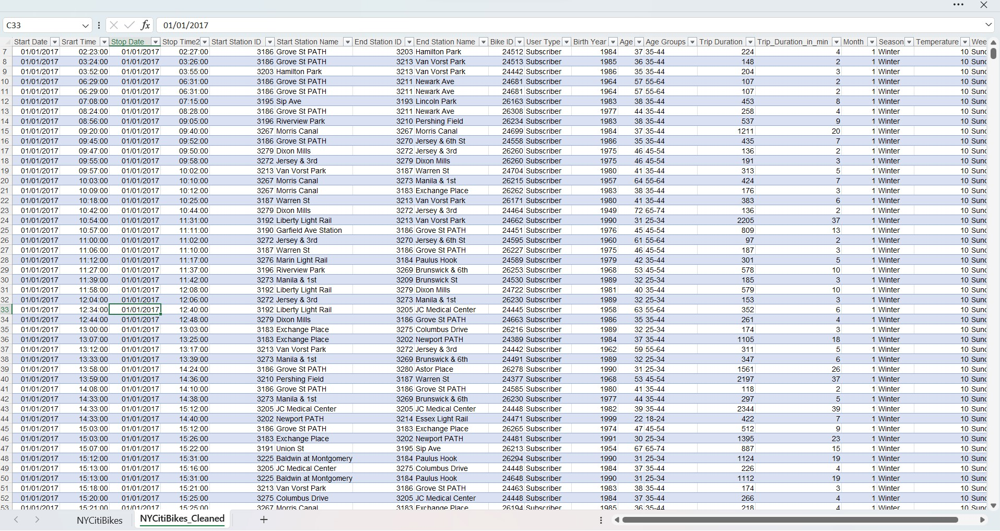

---

## Analysis and Visualization

1. Which station has the highest number of trips originating from it?

With a trip of 2115 Groove St PATH has the highest trips originating from it. 

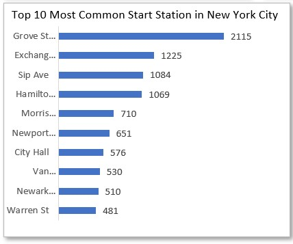

2. Which month had the highest number of bike trips?

The month of march has the highest bike trip with a 7174 trips in total.

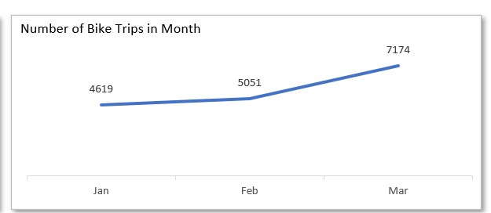

3. How many trips were taken by each user type?

With a percentage of 98.11%, the subscriber user type has the highest trip. 

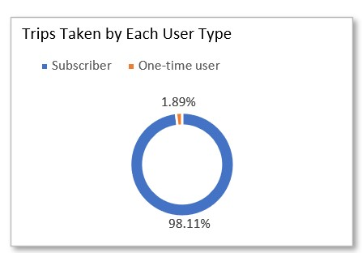

4. Which age group has the highest number of bike riders?

The age group 35-44 has the highest trip with 7698 bike riders.

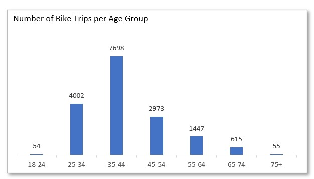

5. Which bike was used for the longest trip?

The bike with model 24664 is the most commonly used bike for long distance journey.

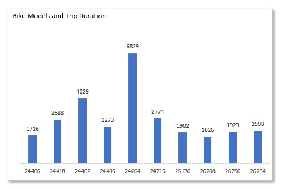

6. What is the distribution of trip durations among different seasons?

The winter season is good for biking as it has the highest trip durations.

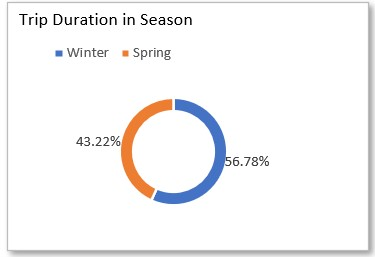

7. What is the average trip duration for each day of the week?

Friday is leading with an average trip of 13.28 followed by Saturday and Sunday with 12.81 and 10.81 respectively. 

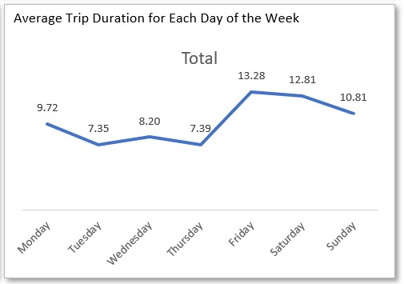

8. Which station has the highest number of trips ending at it?

Groove St PATH has the highest number of trips ending at its station with 2743 trips and it turns out to be the commonest station.

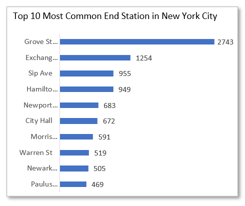

This is a preview of the Dashboard

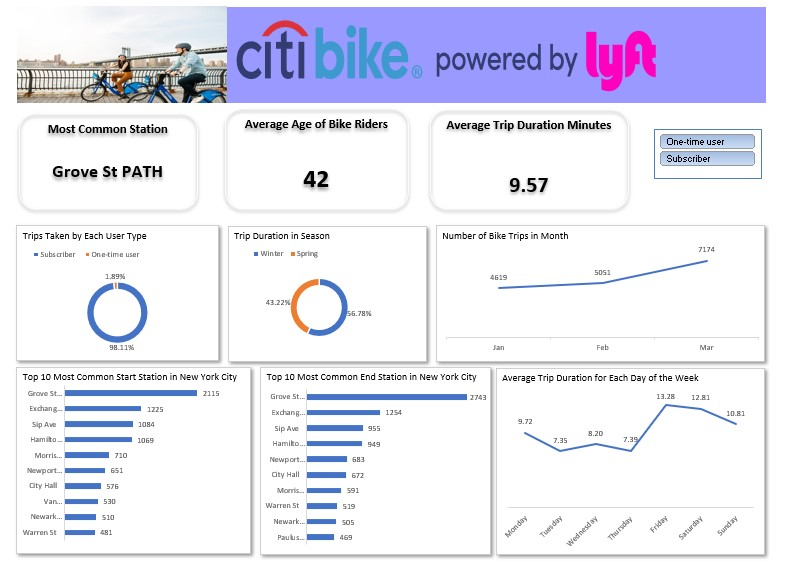

---

## Conclusion and Recommendation

1. Target your marketing efforts to the people within the age range of 35-44, who are most likely to bike. You can also target people who live in areas with a lot of bike lanes, or who work in places that are bike-friendly.
2. Offer discounts or promotions for people who bike on Friday. 
3. Make it easy for people to sign up for a bike share membership. You can do this by offering online registration, or by having a booth at popular events.
4. Partner with local businesses to offer discounts or rewards for people who bike. For example, you could partner with a coffee shop to offer free coffee to people who bike there.
5. Make sure your bike share system is easy to use. This includes having clear signage, well-maintained bikes, and a user-friendly app.
6. Promote Groove St Path as a popular destination for bike trips. You could do this by creating a map of popular bike routes that include Groove St Path, or by running a social media campaign that highlights Groove St Path.
7. Offer discounts for bike trips that start or end at Groove St Path. This would encourage people to use Groove St Path more often and help increase the number of bike trips overall.
8. Target your marketing efforts to people who live or work near Groove St Path. This would make people more likely to see your ads and take advantage of your discounts.

---

